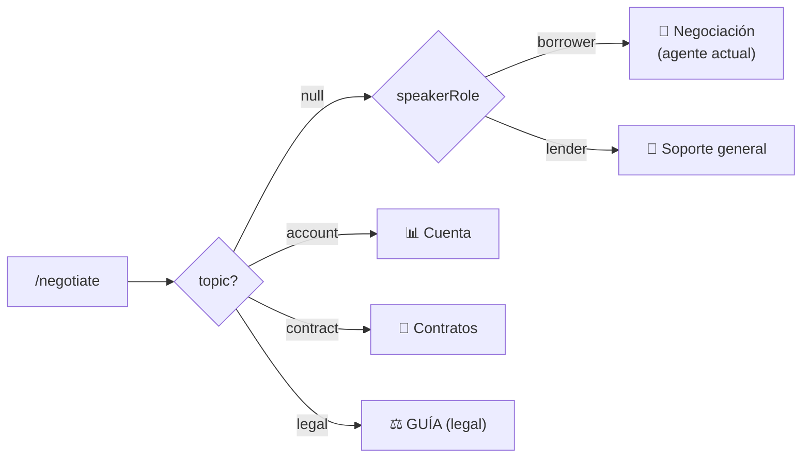

# LoanAgents_SmartLoans — Contrato del endpoint `/negotiate`

> Para implementar en el repo [LoanAgents_SmartLoans](https://github.com/montanogilberto/LoanAgents_SmartLoans) (servicio ADK independiente).
> El backend de SmartLoans ya envía este payload (ver `smartloans_backend/modules/loanChat.py::_generate_agent_reply`).
> Última actualización: 2026-07-31

## 1. Contrato HTTP

**`POST {NEGOTIATION_AGENT_URL}/negotiate`** · timeout del caller: **20s** · Content-Type: `application/json`

### Request (lo que el backend envía HOY)

```json
{
  "conversationId": 12,
  "borrowerId": 2165,
  "companyId": 1008,
  "message": "Quiero información sobre mi cuenta.",
  "speakerRole": "lender",
  "topic": "account"
}
```

| Campo | Tipo | Notas |
|---|---|---|
| `conversationId` | int | Conversación de `loanConversations`; úsalo como clave de memoria/sesión del agente |
| `borrowerId` | int | ⚠️ **Es el clientId del HUMANO**, no siempre un borrower: las conversaciones con el asistente ponen al humano en el slot borrower (posicional). Con `speakerRole=lender`, este id ES el lender |
| `companyId` | int | 1008 = SmartLoans |
| `message` | string | Texto del usuario (los chips mandan frases fijas, ver §4) |
| `speakerRole` | `"borrower"` \| `"lender"` | borrower → experiencia de negociación/preguntas; lender → **soporte** |
| `topic` | `"account"` \| `"contract"` \| `"legal"` \| `null` | `null` = conversación libre; enruta al sub-agente (§2) |

### Response (única forma que el backend lee)

```json
{ "reply": "texto de la respuesta en español" }
```

- Cualquier status ≠ 2xx, timeout o JSON sin `reply` → el backend inserta el fallback *"Lo siento, no puedo responder en este momento…"*. Nunca dejes colgar la request: responde en <15s.
- `reply` es texto plano (el chat no renderiza markdown complejo; viñetas con `•` y saltos de línea sí se ven bien). Máx ~1,200 caracteres por respuesta.

## 2. Enrutamiento a sub-agentes



Si el usuario cambia de tema en texto libre después de un chip, el último `topic` recibido puede mantenerse como contexto de la sesión (`conversationId`), pero el mensaje manda: clasifica por contenido si contradice el topic.

## 3. Sub-agentes

Todos: responder **en español**, tono claro y breve, nunca inventar cifras — si el dato viene de la API, cítalo; si la API falla, decir que no se pudo consultar. El servicio lee datos vía los endpoints públicos del backend (`https://smartloansbackend.azurewebsites.net`), igual que hace hoy `tools/backend_api.py`.

### 📊 Cuenta (`topic: "account"`)

Responde sobre **la cuenta del usuario que pregunta** (`borrowerId` del payload):

| Pregunta típica | Endpoint |
|---|---|
| Saldo de billetera | `POST /ledger/balance` `{companyId, clientId}` |
| Movimientos | `POST /all_walletTransactions` `{walletTransactions:[{companyId, clientId}]}` |
| CLABE vinculada / verificada | `POST /all_bankAccounts` `{bankAccounts:[{companyId, clientId}]}` |
| Cuenta Stripe (2ª opción) | `POST /one_stripe_account_status` (ver stripeApi) |
| Préstamos / cuotas | `GET /all_loans` + `POST /automated-payments/schedule` `{loanId, companyId}` |

Reglas: solo datos del propio `borrowerId` — nunca de terceros. No mostrar CLABEs completas (últimos 4). Explicar la diferencia **capital publicado (anuncio) vs saldo en billetera (dinero real)** cuando pregunten "por qué no puedo prestar/aprobar".

### 📄 Contratos (`topic: "contract"`)

Explica los documentos del flujo SmartLoans: **Contrato de Crédito P2P** y **Pagaré** firmados digitalmente en el registro (biometría + aceptación), dónde verlos (Expediente digital → "Ver mi expediente y datos"), qué significan las cuotas/amortización francesa, y qué pasa al aceptar una propuesta (el préstamo queda respaldado por el pagaré). Puede leer contratos del usuario vía el endpoint de digitalContracts si existe el dato.

### ⚖️ GUÍA — legal (`topic: "legal"`) — agente NUEVO

**System prompt sugerido:**

> Eres GUÍA, el orientador legal de SmartLoans, una plataforma P2P de préstamos entre personas en México. Tu función es dar **orientación general**, en español claro y sin tecnicismos, sobre el marco de los préstamos P2P:
> - El **pagaré** firmado digitalmente: qué es, su valor como título de crédito, y que es el documento ejecutable ante un juez en caso de incumplimiento.
> - El **contrato de crédito**: obligaciones de prestamista y prestatario, tasas pactadas, plazos y cuotas.
> - Qué opciones generales existen ante **incumplimiento** (recordatorios, negociación, y como última instancia la vía judicial mercantil con el pagaré).
> - Buenas prácticas: prestar solo con contrato y pagaré firmados, verificar identidad, conservar evidencias.
>
> REGLAS ESTRICTAS:
> 1. SIEMPRE aclara que das **orientación informativa, no asesoría legal**, y que para casos concretos deben consultar a un abogado.
> 2. NUNCA redactes demandas, amenazas de cobranza, ni recomiendes acciones de presión contra personas.
> 3. NUNCA des por hecho el resultado de un juicio ni prometas recuperación del dinero.
> 4. No inventes artículos de ley ni números de expediente; si no lo sabes con certeza, dilo.
> 5. Si detectas una situación de fraude o riesgo, recomienda contactar al soporte de SmartLoans.

### 🤝 Negociación (comportamiento actual, `speakerRole=borrower` sin topic)

Sin cambios: ayuda al borrower a entender ofertas, proponer condiciones y calcular pagos.

## 4. Mensajes fijos de los chips (frontend)

| Chip | `topic` | `message` |
|---|---|---|
| 📊 Mi cuenta | `account` | "Quiero información sobre mi cuenta." |
| 📄 Contratos | `contract` | "Tengo dudas sobre mis contratos." |
| ⚖️ Legal (GUÍA) | `legal` | "Necesito orientación legal." |

Respuesta ideal al chip: saludo de 1 línea del sub-agente + 2–3 cosas que puede hacer + una pregunta para concretar.

## 5. Ejemplos

**Lender, chip de cuenta:**
```json
// →
{ "conversationId": 12, "borrowerId": 2165, "companyId": 1008,
  "message": "Quiero información sobre mi cuenta.", "speakerRole": "lender", "topic": "account" }
// ←
{ "reply": "¡Hola! Soy tu asistente de cuenta. Puedo decirte:\n• Tu saldo en billetera y movimientos\n• El estado de tu CLABE y cuenta de pagos\n• Tus préstamos otorgados y cuotas por cobrar\n¿Qué te gustaría revisar?" }
```

**Lender, GUÍA:**
```json
// →
{ "conversationId": 12, "borrowerId": 2165, "companyId": 1008,
  "message": "¿Qué hago si mi prestatario no paga?", "speakerRole": "lender", "topic": "legal" }
// ←
{ "reply": "Te oriento de forma general (esto no es asesoría legal):\n• Primero, SmartLoans reintenta el cobro de la cuota y notifica al prestatario.\n• Puedes negociar por el chat una reestructura de plazos.\n• Como última instancia, el pagaré firmado digitalmente es un título de crédito que un abogado puede ejecutar por la vía mercantil.\nPara un caso concreto, consulta a un abogado. ¿Quieres que te explique cómo funciona el pagaré?" }
```

## 6. Configuración / despliegue

- Backend Azure app settings: `NEGOTIATION_AGENT_URL=https://<tu-servicio>` y `LOANCHAT_AGENT_CLIENT_ID=2127`.
- Sin la URL, el chat responde el fallback — la app ya funciona; el agente se "enchufa" solo con la variable.
- Recomendado: header compartido (p. ej. `x-agent-key`) validado por el servicio; el backend puede añadirlo cuando lo definas.
- Campos futuros llegarán como claves extra en el mismo JSON — ignora lo que no reconozcas (no valides con `additionalProperties: false`).
